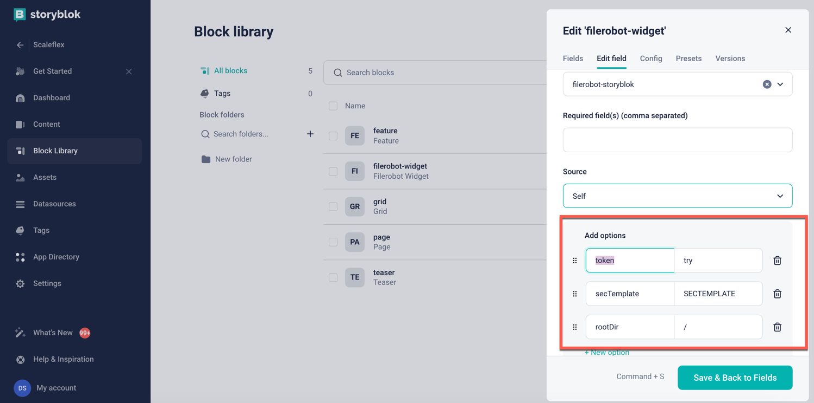
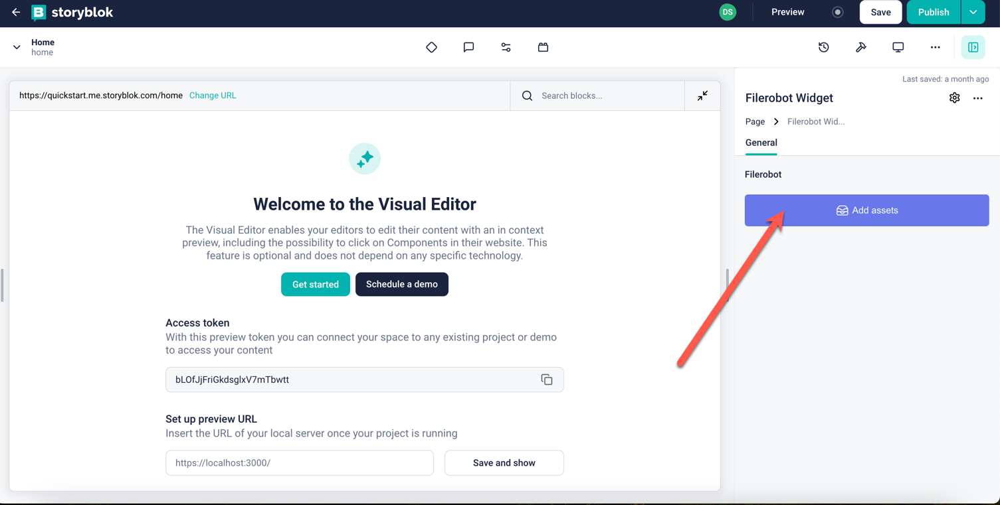
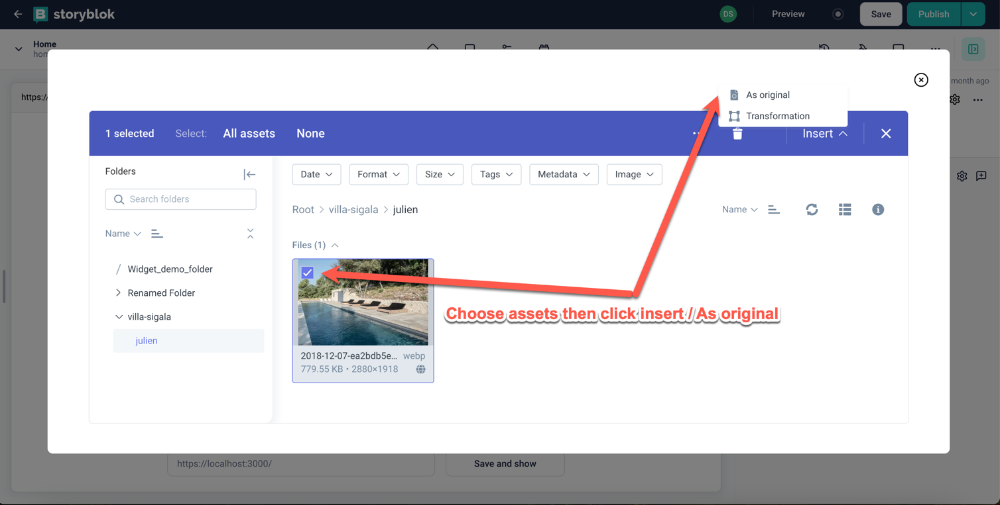
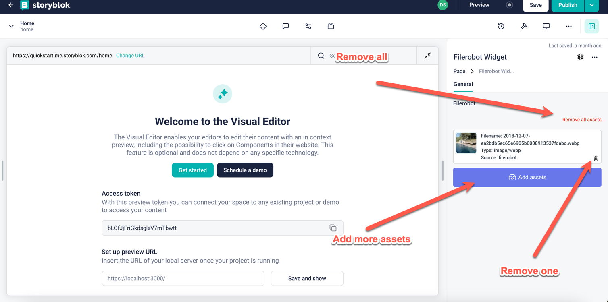

# Storyblok Filerobot

## Requirement
- Node.js v14 or above
- Yarn
- NPM v5.2.0 or above
- You have to register an account from Filerobot: https://www.scaleflex.com/contact-us

## Development
- We are now publishing the App on Marketplace, in meantime to use Filerobot
with Storyblok, please follow manual guide bellow

```shell
git clone git@github.com:scaleflex/storyblok-filerobot.git
yarn 
yarn dev
```

## To Test on Local Development
- Please use the sandbox: https://plugin-sandbox.storyblok.com/field-plugin

## To Deploy on your App
- Get personal access token from: https://app.storyblok.com/#/me/account?tab=token
- Then follow these instruction: https://www.storyblok.com/docs/plugins/field-plugins/deploy
- If you have any issue with duplicated plugin name: Please change the package.json name attribute and redeploy again

## User guide
- You have to get 3 config from the Filerobot hub: Security template, Token, Directory(That already assigned to the Security Template)
- Enter your token in Field plugins before using it: token, secTemplate, rootDir in Field Configurations
  
- To Add Asset please click Add Assets
  
- To insert asset
  
- You can add more, remove one or remove all assets
  
- Content will be structured like bellow
```json
[
  {
    "uuid": "2a9de85c-406a-5101-9ab5-7b6259250001",
    "name": "$R202RV2-AiiacoEg.jpg",
    "cdn": "https://try.filerobot.com/Widget_demo_folder/%24R202RV2-AiiacoEg.jpg?vh=c01224",
    "extension": "jpg",
    "source": "filerobot",
    "type": "image/jpeg"
  },
  {
    "uuid": "c83ca796-00e5-5c08-b87c-cd6ecee50000",
    "name": "012871.tif",
    "cdn": "https://try.filerobot.com/Widget_demo_folder/012871.tif?vh=2ddaba",
    "extension": "tif",
    "source": "filerobot",
    "type": "image/tiff"
  }
]
```
